# T1A2 Portfolio

## [Portfolio website](https://vicky-nie-first-portfolio.netlify.app/) 

## [Github repository](https://github.com/Vickyyn/portfolio)  

&nbsp;  

## Purpose

An easy to navigate website that showcases my skills, interests and background to prospective employers looking for a developer.

## Functionality and features

The website is simple in design to bring focus to the information conveyed. It utilises a blue theme with complementary orange colours for subtle highlights. The pages are responsive across mobile, tablets, and desktop. 

All pages feature a navigation bar at the top that includes a logo that changes colour on hover, and links to all main pages, with the text colour also changing on hover. All pages also feature a footer with links to professional pages. Some pages feature a change in the main content layout between mobile and desktop screens.

There are three main pages:
- Index/home: Core information about myself including name, photo, and contact details. Intentionally left simple to minimise distractions
- About: More information about my background and skills, including a link to my resume
- Blogs: Collection of five blog posts. I have put more flair into this page to engage interest, such as with background shadows, animated overlays, and text changes on hover
  - this page further links to five separate pages of individualised blog posts  

## Sitemap

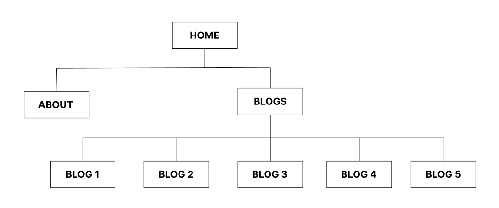  

## Screenshots 

### Index page
Desktop:  
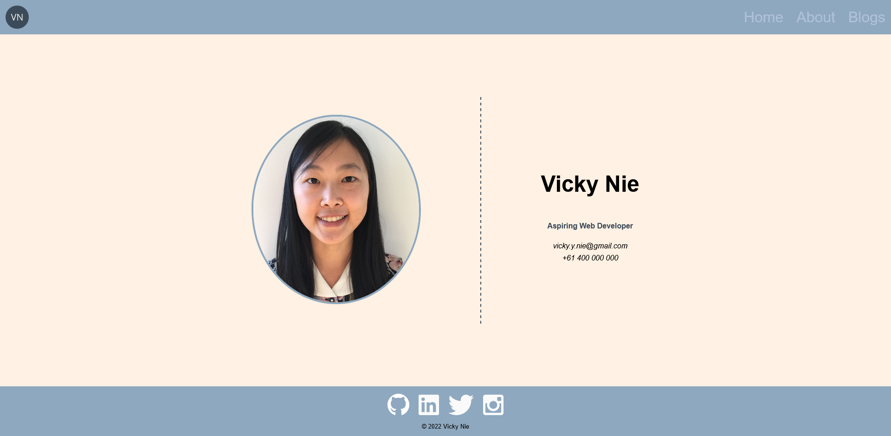  
Tablet landscape:  
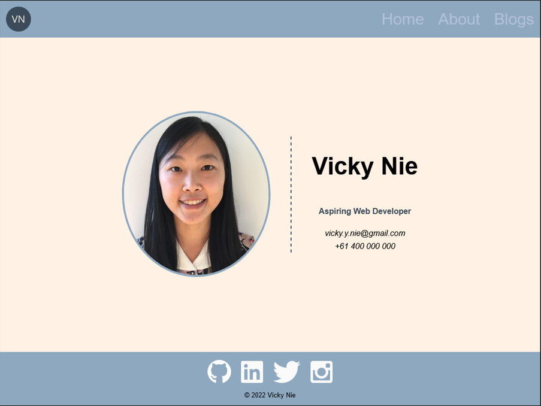  
Tablet portrait:  
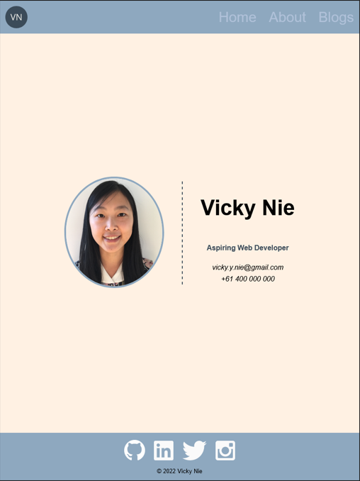  
Mobile:  
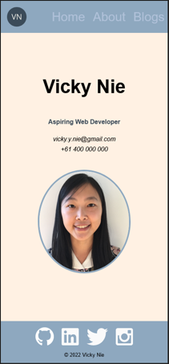  

### About page
Desktop:  
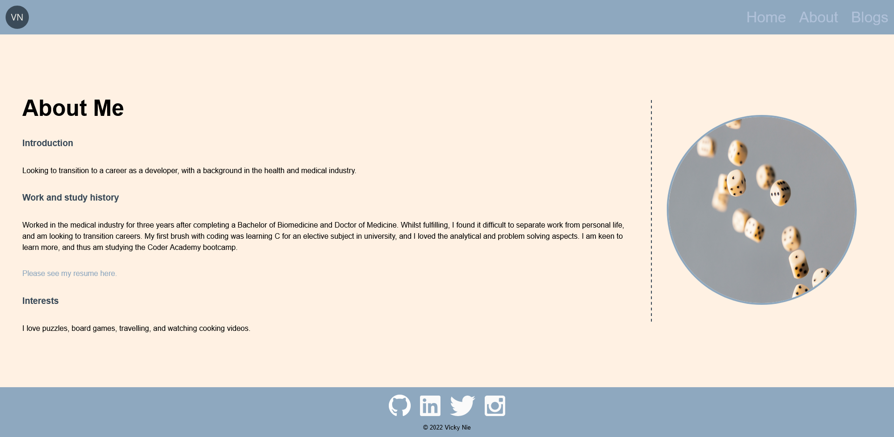  
Tablet landscape:  
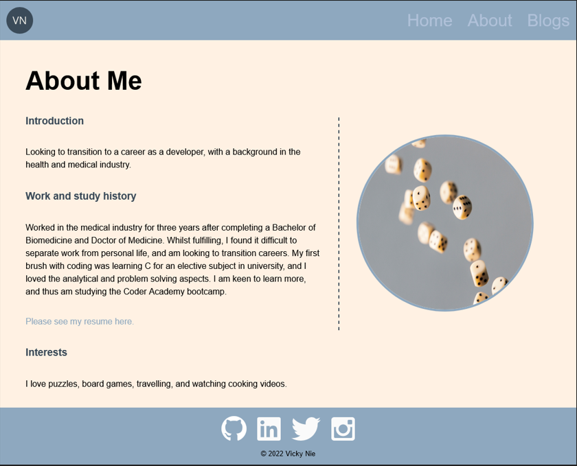  
Tablet portrait:  
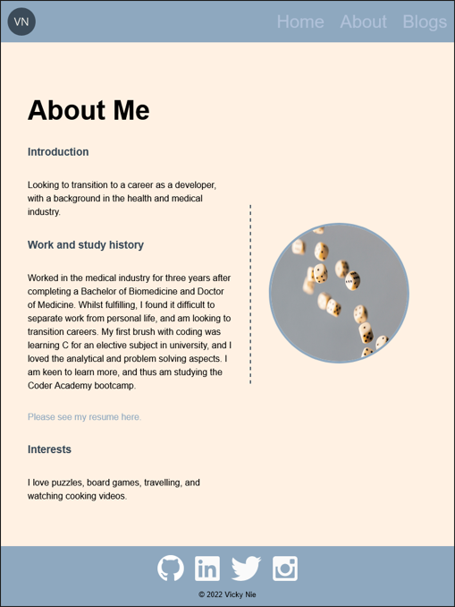  
Mobile:  
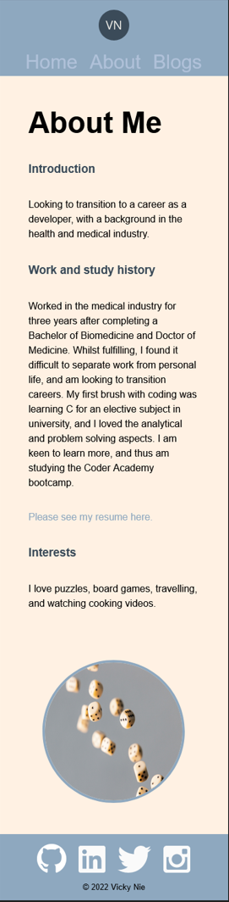  

### Blogs page
Desktop:  
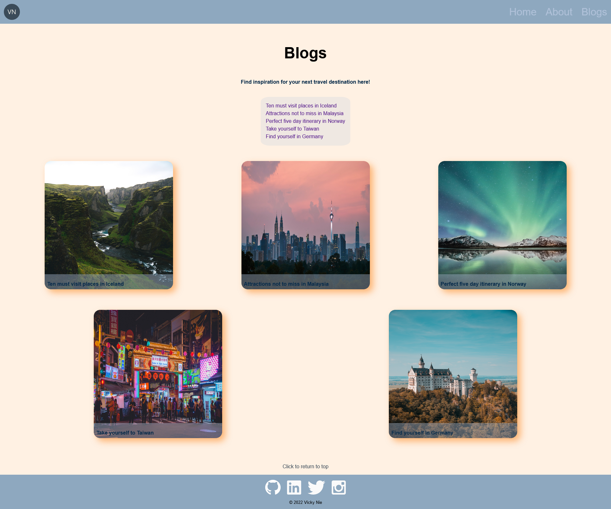  
Tablet landscape:  
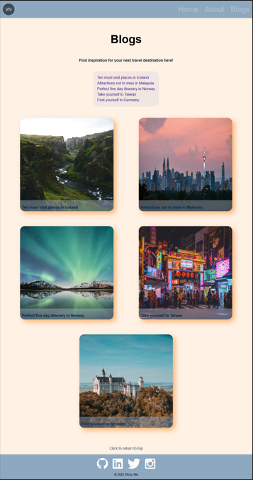  
Tablet portrait:  
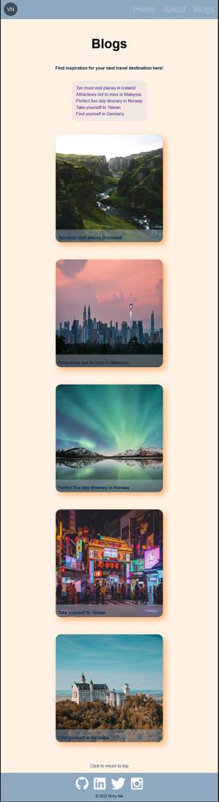  
Mobile:  
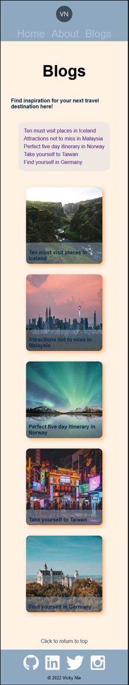  

### Sample blog page
Desktop:  
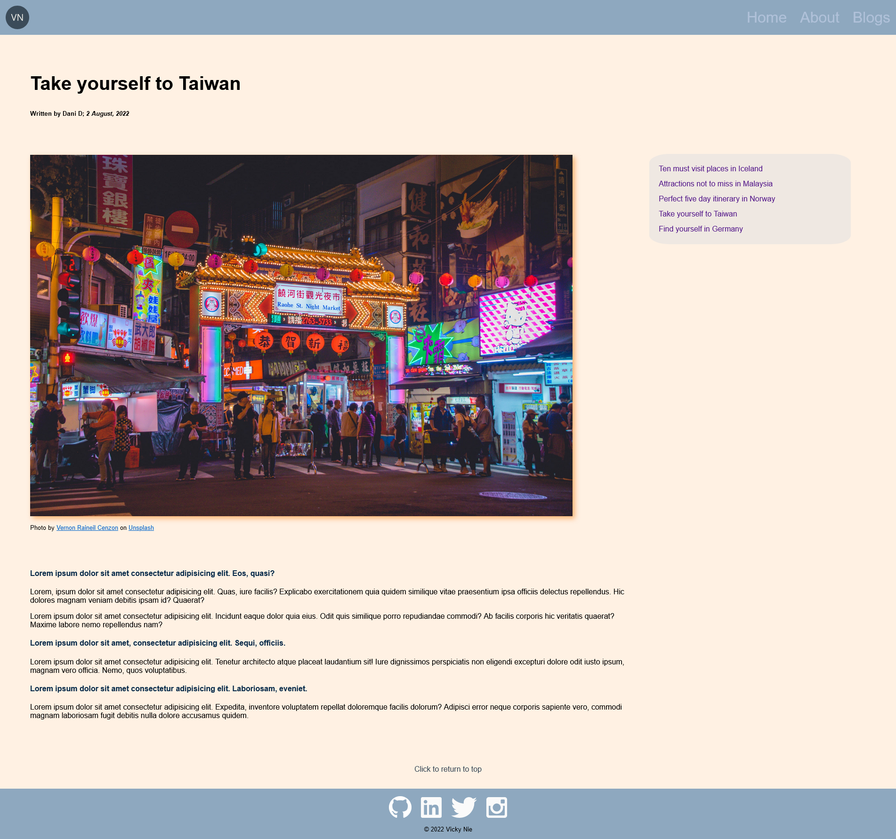  
Tablet landscape:  
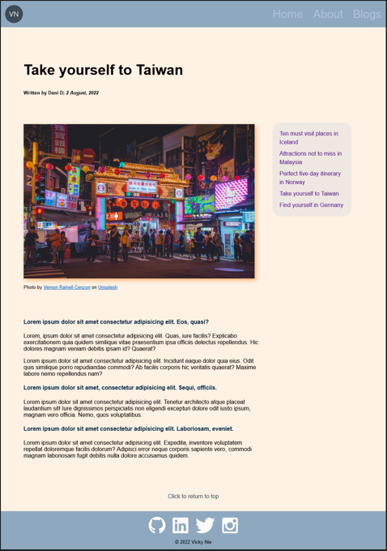  
Tablet portrait:  
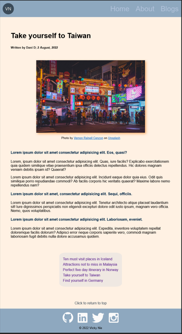  
Mobile:  
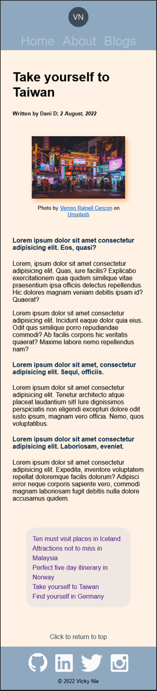  

## Target audience

Prospective employers for an aspiring web developer.

## Technology stack

HTML and CSS. 
Website hosted on Netlify.